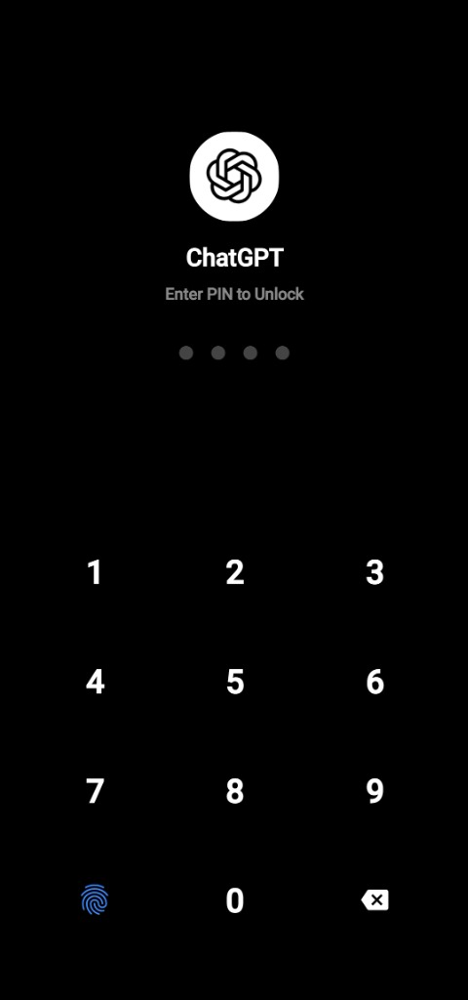
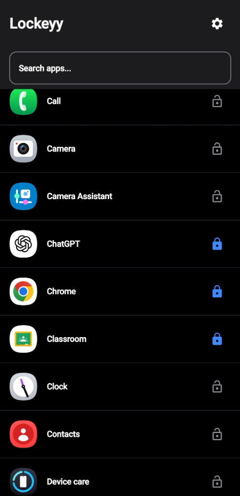
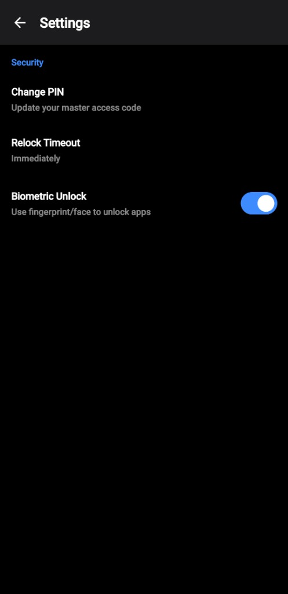

# 🔒 Lockeyy - Modern Android App Locker


**Lockeyy** is a high-performance, aesthetically pleasing Android App Locker built with **Jetpack Compose** and **Modern Android Architecture**. It provides secure application protection using PIN deployment or Biometric authentication (Fingerprint/Face), ensuring privacy with a seamless user experience.

---

## ✨ Key Features

*   **⚡ Instant Locking**: "Zero-Flash" locking mechanism using a high-priority Overlay Service.
*   **🎨 Modern OneUI Design**: Clean, dark-themed UI that feels native to modern Android devices.
*   **👆 Biometric Authentication**: Unlocks instantly using your device's hardware-backed Fingerprint or Face ID.
*   **🔢 PIN Security**: Custom 4-digit PIN fallback with visual shake feedback.
*   **🔄 Smart Relock Logic**: Configurable timeout options (Immediately, 1-20 mins, or After Screen Off).
*   **🛡️ Robust Persistence**: Self-healing Foreground Service that survives background process killing.
*   **🕵️ Fallback Detection**: Uses UsageStats as a backup detection method if Accessibility Service is interrupted.
*   **📱 Splash Screen**: Branded, animated launch experience.

## 🛠️ Tech Stack

*   **Language**: Kotlin
*   **UI Framework**: [Jetpack Compose](https://developer.android.com/jetpack/compose) (Material 3)
*   **Architecture**: MVVM (Model-View-ViewModel) + Clean Architecture
*   **Dependency Injection**: [Hilt](https://dagger.dev/hilt/)
*   **Asynchronous Processing**: [Coroutines](https://github.com/Kotlin/kotlinx.coroutines) & Flow
*   **Local Storage**: [Room Database](https://developer.android.com/training/data-storage/room) & DataStore
*   **Security**: Android KeyStore & Biometric API

## 📸 Screenshots

| Lock Screen | App List | Settings |
|:---:|:---:|:---:|
|  |  |  |
> *Note: Add your screenshots to a `screenshots` folder in the repo to make them visible!*

## 🚀 Getting Started

### Prerequisites
*   Android Studio Iguana or newer.
*   JDK 17 or newer.
*   Android Device/Emulator running Android 10 (API 29) or higher.

### Installation

1.  **Clone the repository**:
    ```bash
    git clone https://github.com/JoyalJose54/Lockeyy.git
    cd Lockeyy
    ```

2.  **Open in Android Studio**:
    *   File -> Open -> Select the `Lockeyy` folder.

3.  **Build & Run**:
    *   Connect your device via USB.
    *   Click the green **Run** button (▶️).

### Permissions Required
Upon first launch, Lockeyy will guide you to enable:
*   **Display Over Other Apps**: To show the lock screen instantly.
*   **Accessibility Service**: To detect when you open a locked app.
*   **Usage Access**: For robust fallback detection.

## 🤝 Contributing

Contributions are welcome! Please feel free to submit a Pull Request.

1.  Fork the project
2.  Create your Feature Branch (`git checkout -b feature/AmazingFeature`)
3.  Commit your Changes (`git commit -m 'Add some AmazingFeature'`)
4.  Push to the Branch (`git push origin feature/AmazingFeature`)
5.  Open a Pull Request

## 📄 License

This project is licensed under the MIT License - see the [LICENSE](LICENSE) file for details.

---
*Built with ❤️ by [JoyalJose54](https://github.com/JoyalJose54)*
